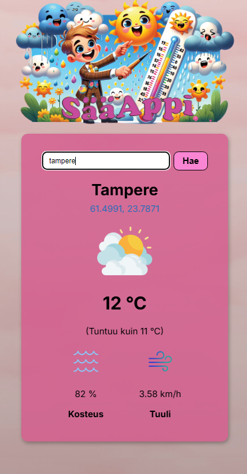

# 🌦️ SääAppi

**SääAppi** on selainpohjainen JavaScript-projekti, jossa käyttäjä voi hakea ajankohtaiset säätiedot haluamalleen paikkakunnalle. Sovellus käyttää OpenWeatherMapin rajapintaa ja näyttää säätiedot visuaalisesti selkeässä ja hauskassa käyttöliittymässä.

## 🎨 Ulkoasu ja toiminnallisuus

- Värikäs ja responsiivinen käyttöliittymä
- Animaatioita ja oma kursoriefekti (Kursor.js)
- Käyttäjä syöttää paikkakunnan, ja sovellus näyttää:
  - Paikan nimen ja koordinaatit (linkki Google Mapsiin)
  - Sääkuvakkeen (esim. aurinko, pilvistä, sade...)
  - Lämpötilan ja miltä se tuntuu
  - Kosteusprosentin ja tuulen nopeuden

## 📦 Projektin rakenne

- **index.html** – sovelluksen HTML-pohja
- **styles.css** – tyyliasettelu ja responsiivisuus
- **script.js** – säätietojen hakeminen ja näyttäminen
- **images/** – sääikoneita, taustakuvia ja bannereita

## 🔗 Teknologiat

- HTML, CSS, JavaScript
- OpenWeatherMap API
- Google Fonts
- Kursor.js

## 🖼️ Näkymä sovelluksesta

---

**Projektin tarkoituksena oli harjoitella JavaScriptin käyttöä, API:n hyödyntämistä sekä käyttöliittymän visuaalista viimeistelyä.**
